# 元件清單與組合關係

> 本檔由 `dart run tool/inventory.dart` 從實際程式碼產生，不是手寫的。
> 元件樹是**真的**組合關係——解析每個型別實作區段內出現的其他 `Klp*` 建構
> 呼叫，因此它不會與程式碼分岔；手寫的架構圖會，而且分岔時沒有任何徵兆。

## 總覽

- 公開型別 **282** 個，其中 widget **160** 個
- 分為 **18** 個領域

### 領域之間的依賴方向

箭頭是「用到」，數字是引用次數。這張圖唯一該有的形狀是**單向**——
`controls` 可以用 `surface`，`surface` 不可以用 `controls`。
出現回頭的箭頭就代表分層破了。

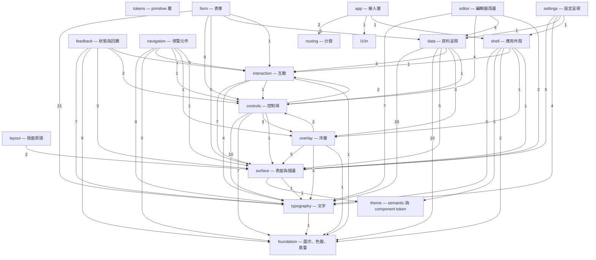

### 分層違規

以下型別用到了比自己更上層的領域。**這些不是待辦事項清單，是設計債**
——一個底層元件依賴上層，代表它被歸錯領域，或它其實不屬於這個庫。

- `interaction/KlpSelectionToolbar → controls/KlpButton`
- `overlay/KlpDialog → controls/KlpButton`
- `overlay/KlpMenuItem → controls/KlpToggleIndicator`

## 各領域的元件樹

### tokens — primitive 層

型別 1 個，widget 0 個。

| 型別 | 行數 | 組成 |
|---|---|---|
| `KlpScale` | 107 | （葉節點） |

### theme — semantic 與 component token

型別 22 個，widget 1 個。

| 型別 | 行數 | 組成 |
|---|---|---|
| `KlpComponentTheme` | 174 | （葉節點） |
| `KlpControlGeometry` | 88 | （葉節點） |
| `KlpDataGeometry` | 99 | （葉節點） |
| `KlpDataVisualizationTheme` | 190 | （葉節點） |
| `KlpFieldFillState` | 3 | （葉節點） |
| `KlpFieldStyle` | 269 | （葉節點） |
| `KlpGeometryTheme` | 118 | `KlpControlGeometry`、`KlpDataGeometry`、`KlpLayoutGeometry`、`KlpOpticalGeometry` |
| `KlpLayoutGeometry` | 107 | （葉節點） |
| `KlpMotionTheme` | 139 | （葉節點） |
| `KlpOpticalGeometry` | 34 | （葉節點） |
| `KlpShapeTheme` | 150 | （葉節點） |
| `KlpSpacingTheme` | 510 | （葉節點） |
| `KlpSurfaceSeparation` | 19 | （葉節點） |
| `KlpSurfaceTheme` | 282 | （葉節點） |
| `KlpTheme` | 131 | `KlpVisualStyle` |
| `KlpThemeContrast` | 26 | （葉節點） |
| `KlpThemeData` | 377 | （葉節點） |
| `KlpThemeVariant` | 8 | （葉節點） |
| `KlpTokenOverride` | 41 | （葉節點） |
| `KlpTypographyTheme` | 378 | （葉節點） |
| `KlpVisualStyle` | 118 | （葉節點） |
| `KlpVisualStyleJson` | 84 | `KlpVisualStyle` |

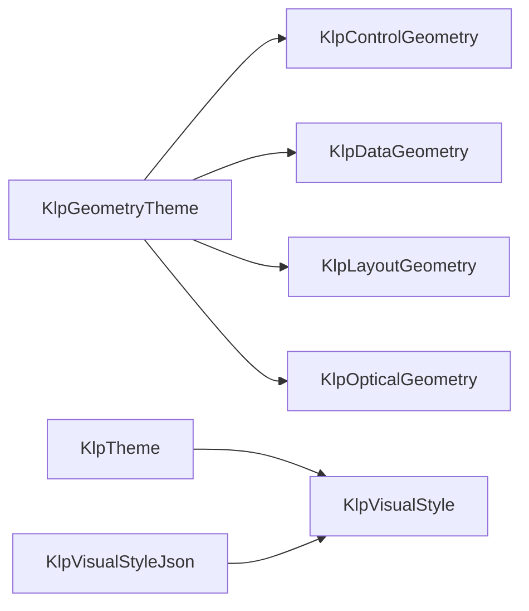

虛線框是其他領域的型別。

### foundation — 圖示、色盤、度量

型別 21 個，widget 4 個。

| 型別 | 行數 | 組成 |
|---|---|---|
| `KlpAccent` | 26 | （葉節點） |
| `KlpCodeMetrics` | 21 | （葉節點） |
| `KlpControlMetrics` | 14 | （葉節點） |
| `KlpDecorativePalette` | 18 | （葉節點） |
| `KlpElevation` | 14 | （葉節點） |
| `KlpFormMetrics` | 18 | （葉節點） |
| `KlpGeometricSpinner` | 164 | （葉節點） |
| `KlpIcon` | 34 | （葉節點） |
| `KlpIcons` | 82 | （葉節點） |
| `KlpInlineCode` | 54 | （葉節點） |
| `KlpLayoutGap` | 8 | （葉節點） |
| `KlpLine` | 13 | （葉節點） |
| `KlpMotion` | 9 | （葉節點） |
| `KlpPalette` | 205 | （葉節點） |
| `KlpPlaceholderMetrics` | 23 | （葉節點） |
| `KlpRadius` | 18 | （葉節點） |
| `KlpSegmentedProgress` | 34 | （葉節點） |
| `KlpSize` | 35 | （葉節點） |
| `KlpSpace` | 16 | （葉節點） |
| `KlpTransparency` | 4 | （葉節點） |
| `KlpTypography` | 71 | （葉節點） |

### typography — 文字

型別 11 個，widget 2 個。

| 型別 | 行數 | 組成 |
|---|---|---|
| `KlpFontRole` | 11 | （葉節點） |
| `KlpRichText` | 135 | `KlpInlineCode`、`KlpText` |
| `KlpRichTextKind` | 19 | （葉節點） |
| `KlpRichTextNode` | 26 | （葉節點） |
| `KlpRichTextSpan` | 10 | （葉節點） |
| `KlpText` | 128 | （葉節點） |
| `KlpTextColorTier` | 4 | （葉節點） |
| `KlpTextRole` | 24 | （葉節點） |
| `KlpTextStyleDefinition` | 41 | （葉節點） |
| `KlpTextStyles` | 177 | `KlpTextStyleDefinition` |
| `KlpTextTone` | 7 | （葉節點） |

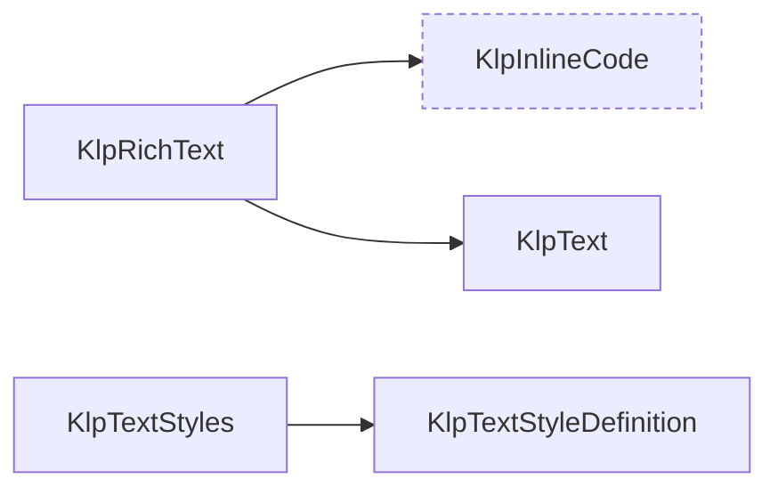

虛線框是其他領域的型別。

### surface — 表面與描邊

型別 9 個，widget 6 個。

| 型別 | 行數 | 組成 |
|---|---|---|
| `KlpDashedBorder` | 51 | `KlpStrokeFrame` |
| `KlpDashedDivider` | 111 | （葉節點） |
| `KlpDivider` | 14 | （葉節點） |
| `KlpSection` | 46 | `KlpText` |
| `KlpStrokeFrame` | 139 | （葉節點） |
| `KlpStrokeRole` | 2 | （葉節點） |
| `KlpStrokeState` | 2 | （葉節點） |
| `KlpSurface` | 106 | `KlpTokenOverride` |
| `KlpSurfaceTone` | 16 | （葉節點） |

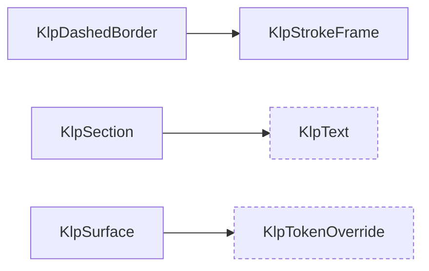

虛線框是其他領域的型別。

### interaction — 互動

型別 14 個，widget 9 個。

| 型別 | 行數 | 組成 |
|---|---|---|
| `KlpDragPreview` | 18 | `KlpSurface` |
| `KlpDropIndicator` | 17 | （葉節點） |
| `KlpDropTarget` | 19 | `KlpStrokeFrame`、`KlpSurface` |
| `KlpFilterBar` | 169 | `KlpDashedBorder`、`KlpIcon`、`KlpPressable`、`KlpText` |
| `KlpFilterOption` | 15 | （葉節點） |
| `KlpHighlightState` | 19 | （葉節點） |
| `KlpInteractionSettings` | 27 | （葉節點） |
| `KlpPresenceIndicator` | 33 | `KlpText` |
| `KlpPressable` | 191 | （葉節點） |
| `KlpRovingIndex` | 41 | （葉節點） |
| `KlpSelectionAction` | 15 | （葉節點） |
| `KlpSelectionToolbar` | 75 | `KlpButton`、`KlpDashedBorder`、`KlpPressable`、`KlpSurface`、`KlpText` |
| `KlpShortcutHint` | 20 | `KlpSurface`、`KlpText` |
| `KlpStateHighlight` | 43 | （葉節點） |

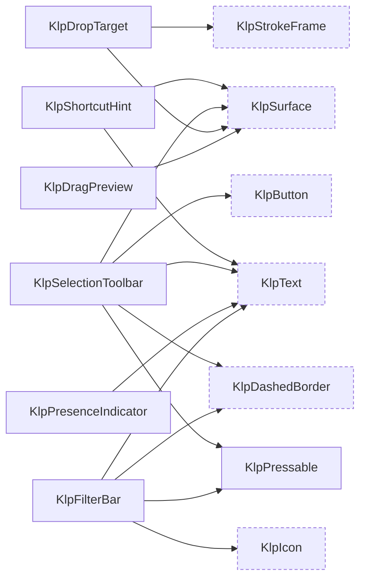

虛線框是其他領域的型別。

### layout — 版面原語

型別 8 個，widget 8 個。

| 型別 | 行數 | 組成 |
|---|---|---|
| `KlpOverlayHost` | 16 | （葉節點） |
| `KlpRegion` | 40 | `KlpSurface` |
| `KlpResizablePane` | 13 | （葉節點） |
| `KlpResizeHandle` | 23 | （葉節點） |
| `KlpScrollViewport` | 23 | （葉節點） |
| `KlpSplitLayout` | 62 | `KlpDashedDivider` |
| `KlpVirtualGrid` | 45 | （葉節點） |
| `KlpVirtualList` | 26 | （葉節點） |

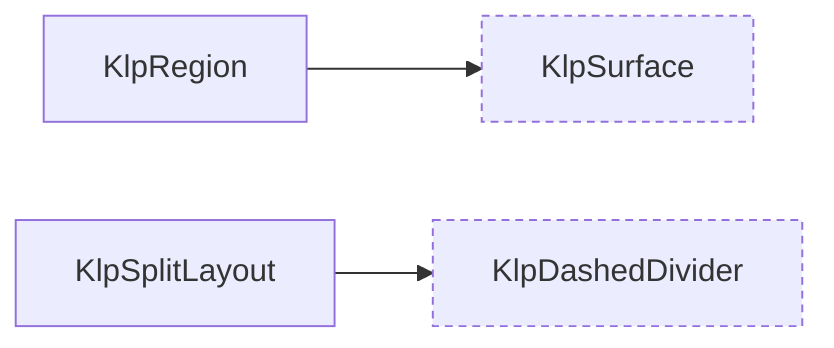

虛線框是其他領域的型別。

### overlay — 浮層

型別 13 個，widget 8 個。

| 型別 | 行數 | 組成 |
|---|---|---|
| `KlpContextMenu` | 145 | `KlpMenu`、`KlpMenuItemData` |
| `KlpContextMenuController` | 31 | （葉節點） |
| `KlpDialog` | 76 | `KlpButton`、`KlpSurface`、`KlpText` |
| `KlpDrawer` | 94 | `KlpSurface` |
| `KlpDrawerEdge` | 9 | （葉節點） |
| `KlpMenu` | 171 | `KlpDivider`、`KlpMenuItem`、`KlpSurface`、`KlpText` |
| `KlpMenuItem` | 120 | `KlpIcon`、`KlpText`、`KlpToggleIndicator` |
| `KlpMenuItemData` | 36 | （葉節點） |
| `KlpMenuLayout` | 98 | （葉節點） |
| `KlpMenuStyle` | 31 | （葉節點） |
| `KlpPopover` | 15 | `KlpSurface` |
| `KlpTooltip` | 12 | （葉節點） |
| `KlpTooltipSurface` | 42 | （葉節點） |

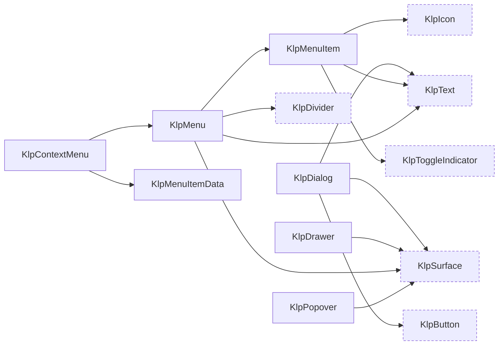

虛線框是其他領域的型別。

### controls — 控制項

型別 21 個，widget 15 個。

| 型別 | 行數 | 組成 |
|---|---|---|
| `KlpButton` | 138 | `KlpPressable`、`KlpText` |
| `KlpButtonTone` | 5 | （葉節點） |
| `KlpCheckbox` | 74 | `KlpIcon`、`KlpText` |
| `KlpCombobox` | 208 | `KlpMenu`、`KlpMenuItemData`、`KlpTextField` |
| `KlpComboboxOption` | 23 | （葉節點） |
| `KlpCompactSwitch` | 58 | `KlpPressable` |
| `KlpControlSize` | 1 | （葉節點） |
| `KlpIconButton` | 72 | `KlpIcon`、`KlpTooltip` |
| `KlpPhaseOption` | 19 | （葉節點） |
| `KlpPhaseToggle` | 161 | `KlpIcon`、`KlpText` |
| `KlpRadioGroup` | 133 | `KlpText` |
| `KlpSegmentedControl` | 152 | `KlpIcon`、`KlpText` |
| `KlpSelect` | 84 | `KlpIcon`、`KlpStrokeFrame`、`KlpText` |
| `KlpSelectionOption` | 7 | （葉節點） |
| `KlpSlider` | 78 | `KlpText` |
| `KlpSlidingSelection` | 111 | `KlpIcon` |
| `KlpTextField` | 277 | `KlpIcon`、`KlpText` |
| `KlpToggle` | 51 | `KlpText`、`KlpToggleIndicator` |
| `KlpToggleIndicator` | 53 | （葉節點） |
| `KlpTriState` | 2 | （葉節點） |
| `KlpTriStateToggle` | 41 | `KlpSelectionOption`、`KlpSlidingSelection`、`KlpText` |

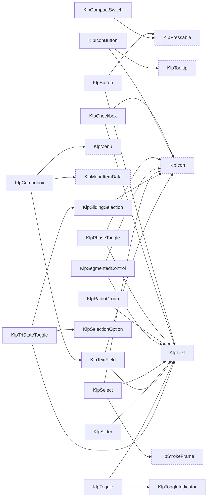

虛線框是其他領域的型別。

### data — 資料呈現

型別 43 個，widget 22 個。

| 型別 | 行數 | 組成 |
|---|---|---|
| `KlpAccordion` | 165 | `KlpIcon`、`KlpText` |
| `KlpAccordionItemData` | 20 | （葉節點） |
| `KlpAvatar` | 41 | `KlpText` |
| `KlpAvatarData` | 8 | （葉節點） |
| `KlpAvatarGroup` | 35 | `KlpAvatar` |
| `KlpBadge` | 92 | `KlpText` |
| `KlpBadgeVariant` | 12 | （葉節點） |
| `KlpCard` | 75 | `KlpText` |
| `KlpCodeLanguageOption` | 12 | （葉節點） |
| `KlpCodeLanguages` | 31 | `KlpCodeLanguageOption` |
| `KlpCodeViewer` | 552 | `KlpIcon`、`KlpMenu`、`KlpMenuItemData`、`KlpPressable`、`KlpText`、`KlpTooltip` |
| `KlpCodeViewerLabels` | 27 | （葉節點） |
| `KlpDataAlignment` | 3 | （葉節點） |
| `KlpDataColumn` | 20 | （葉節點） |
| `KlpDataRow` | 12 | （葉節點） |
| `KlpDataSort` | 12 | （葉節點） |
| `KlpDataTable` | 209 | `KlpCheckbox`、`KlpDashedDivider`、`KlpIcon`、`KlpSurface`、`KlpText` |
| `KlpDiffLine` | 32 | （葉節點） |
| `KlpDiffLineType` | 13 | （葉節點） |
| `KlpDiffViewer` | 210 | `KlpPressable`、`KlpText` |
| `KlpFilePreview` | 176 | `KlpDashedDivider`、`KlpGeometricSpinner`、`KlpText` |
| `KlpFilePreviewState` | 8 | （葉節點） |
| `KlpJsonTree` | 186 | `KlpIcon`、`KlpSurface`、`KlpText` |
| `KlpKeyValueItem` | 16 | （葉節點） |
| `KlpKeyValueList` | 74 | `KlpIcon`、`KlpText` |
| `KlpKeyValueRowData` | 7 | （葉節點） |
| `KlpKeyValueTable` | 62 | `KlpSurface`、`KlpText` |
| `KlpListTile` | 141 | `KlpIcon`、`KlpText` |
| `KlpMetricCard` | 102 | `KlpText` |
| `KlpProgress` | 82 | `KlpText` |
| `KlpProgressState` | 2 | （葉節點） |
| `KlpSortControl` | 32 | `KlpIcon`、`KlpText` |
| `KlpSortDirection` | 8 | （葉節點） |
| `KlpStepData` | 11 | （葉節點） |
| `KlpStepStatus` | 4 | （葉節點） |
| `KlpStepper` | 251 | `KlpIcon`、`KlpText` |
| `KlpTag` | 61 | `KlpText` |
| `KlpTerminal` | 119 | `KlpPressable`、`KlpText` |
| `KlpTimeline` | 123 | `KlpText` |
| `KlpTimelineItemData` | 20 | （葉節點） |
| `KlpTree` | 45 | （葉節點） |
| `KlpTreeItem` | 174 | `KlpIcon`、`KlpStateHighlight`、`KlpText` |
| `KlpTreeNode` | 31 | （葉節點） |

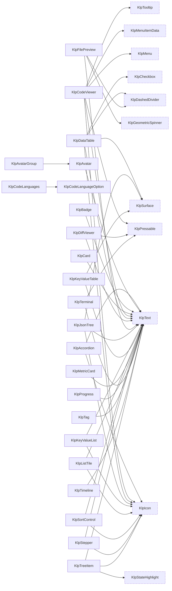

虛線框是其他領域的型別。

### form — 表單

型別 41 個，widget 29 個。

| 型別 | 行數 | 組成 |
|---|---|---|
| `KlpApprovalStepData` | 8 | （葉節點） |
| `KlpApprovalStepsField` | 153 | `KlpText` |
| `KlpCalendar` | 248 | `KlpIconButton`、`KlpStateHighlight`、`KlpText` |
| `KlpCalendarRange` | 28 | （葉節點） |
| `KlpCalendarSelectionMode` | 7 | （葉節點） |
| `KlpChoiceOption` | 18 | （葉節點） |
| `KlpCodeEditorField` | 112 | `KlpText` |
| `KlpCodeField` | 41 | `KlpCodeViewer`、`KlpText`、`KlpTextArea` |
| `KlpColorRoleField` | 29 | `KlpSelectField` |
| `KlpConditionalFieldRegion` | 18 | （葉節點） |
| `KlpDateField` | 83 | `KlpCalendar`、`KlpTextField` |
| `KlpDateFieldCalendar` | 33 | （葉節點） |
| `KlpField` | 123 | `KlpFieldDescription`、`KlpFieldLabel`、`KlpText` |
| `KlpFieldDescription` | 20 | `KlpText` |
| `KlpFieldError` | 24 | `KlpText` |
| `KlpFieldGroup` | 31 | `KlpField` |
| `KlpFieldLabel` | 16 | `KlpText` |
| `KlpFieldVisualState` | 19 | （葉節點） |
| `KlpFileAttachment` | 13 | （葉節點） |
| `KlpFileDropzoneField` | 148 | `KlpText` |
| `KlpFileField` | 43 | `KlpButton`、`KlpFilePreview`、`KlpText` |
| `KlpFileValue` | 13 | （葉節點） |
| `KlpForm` | 40 | （葉節點） |
| `KlpFormActions` | 53 | `KlpButton` |
| `KlpFormErrorSummary` | 52 | `KlpSurface`、`KlpText` |
| `KlpFormSection` | 56 | `KlpSurface`、`KlpText` |
| `KlpKeyValueEditor` | 66 | `KlpText`、`KlpTextField` |
| `KlpKeyValueEntry` | 25 | （葉節點） |
| `KlpMultiSelectField` | 64 | `KlpText` |
| `KlpNumberField` | 41 | `KlpTextField` |
| `KlpPasswordField` | 149 | `KlpText` |
| `KlpPasswordRequirement` | 8 | （葉節點） |
| `KlpReferenceOption` | 16 | （葉節點） |
| `KlpReferencePicker` | 81 | `KlpBadge`、`KlpSurface`、`KlpText`、`KlpTextField` |
| `KlpRepeaterField` | 57 | `KlpButton`、`KlpSurface`、`KlpText` |
| `KlpRepeaterItem` | 12 | （葉節點） |
| `KlpSelectField` | 101 | `KlpStrokeFrame`、`KlpText` |
| `KlpStatusRoleSwatches` | 80 | `KlpText` |
| `KlpTagChip` | 44 | `KlpText` |
| `KlpTagInputField` | 84 | `KlpTagChip`、`KlpText` |
| `KlpTextArea` | 38 | `KlpTextField` |

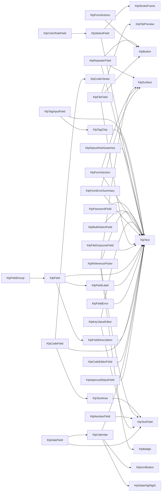

虛線框是其他領域的型別。

### feedback — 狀態與回饋

型別 14 個，widget 11 個。

| 型別 | 行數 | 組成 |
|---|---|---|
| `KlpEmptyState` | 52 | `KlpDashedBorder`、`KlpIcon`、`KlpText` |
| `KlpErrorState` | 34 | `KlpButton` |
| `KlpFeedbackTone` | 29 | （葉節點） |
| `KlpInlineNotice` | 99 | `KlpIcon`、`KlpSurface`、`KlpText` |
| `KlpLoadingState` | 35 | `KlpGeometricSpinner`、`KlpText` |
| `KlpPermissionState` | 26 | （葉節點） |
| `KlpProgressOverlay` | 95 | `KlpDashedBorder`、`KlpIcon`、`KlpLoadingState`、`KlpText` |
| `KlpRegionPlaceholder` | 275 | `KlpPressable`、`KlpText` |
| `KlpRegionPlaceholderTone` | 2 | （葉節點） |
| `KlpSkeletonLine` | 19 | （葉節點） |
| `KlpStatusIndicator` | 93 | `KlpIcon`、`KlpText` |
| `KlpStatusKind` | 24 | （葉節點） |
| `KlpToast` | 115 | `KlpButton`、`KlpIcon`、`KlpText` |
| `KlpToastStack` | 20 | （葉節點） |

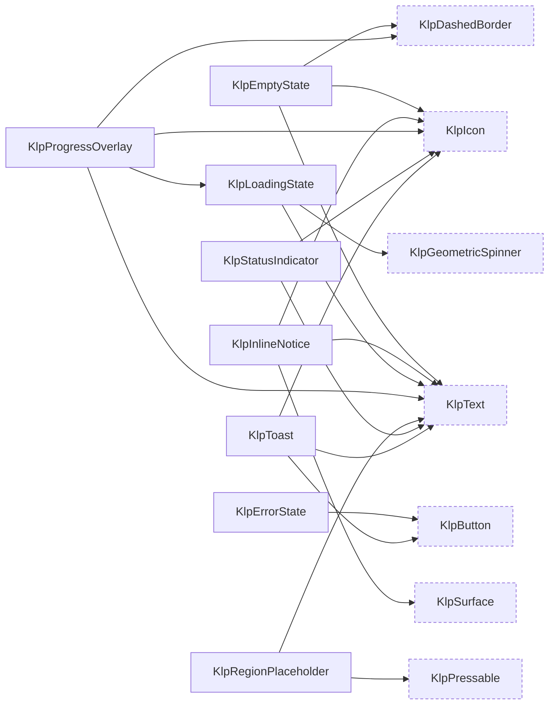

虛線框是其他領域的型別。

### navigation — 導覽元件

型別 15 個，widget 12 個。

| 型別 | 行數 | 組成 |
|---|---|---|
| `KlpActionGroup` | 20 | （葉節點） |
| `KlpBreadcrumb` | 34 | `KlpText` |
| `KlpFileExplorer` | 132 | `KlpFileExplorerSectionView` |
| `KlpFileExplorerFolderView` | 108 | `KlpIcon`、`KlpStateHighlight`、`KlpText` |
| `KlpFileExplorerItem` | 33 | （葉節點） |
| `KlpFileExplorerItemView` | 105 | `KlpIcon`、`KlpStateHighlight`、`KlpText` |
| `KlpFileExplorerSection` | 20 | （葉節點） |
| `KlpFileExplorerSectionView` | 150 | `KlpFileExplorerFolderView`、`KlpFileExplorerItemView`、`KlpIcon`、`KlpText` |
| `KlpPagination` | 46 | `KlpButton`、`KlpText` |
| `KlpRailItem` | 125 | `KlpIcon`、`KlpTooltipSurface` |
| `KlpSidebarNavigationButton` | 84 | `KlpIcon`、`KlpPressable`、`KlpText` |
| `KlpSidebarSectionLabel` | 27 | `KlpText` |
| `KlpTabs` | 106 | `KlpText` |
| `KlpViewOption` | 14 | （葉節點） |
| `KlpViewSwitcher` | 83 | `KlpSurface`、`KlpText` |

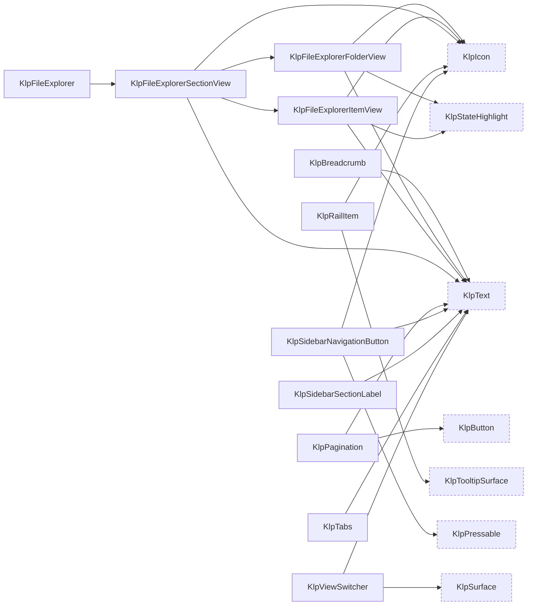

虛線框是其他領域的型別。

### editor — 編輯器周邊

型別 14 個，widget 8 個。

| 型別 | 行數 | 組成 |
|---|---|---|
| `KlpBulkActionBar` | 26 | `KlpText` |
| `KlpCommandItemData` | 19 | （葉節點） |
| `KlpCommandMenu` | 214 | `KlpText` |
| `KlpCommandSectionData` | 17 | （葉節點） |
| `KlpEditorActionData` | 14 | （葉節點） |
| `KlpEditorToolbar` | 17 | （葉節點） |
| `KlpEntityPicker` | 111 | `KlpBadge`、`KlpButton`、`KlpText`、`KlpTextField` |
| `KlpEntityResultData` | 14 | （葉節點） |
| `KlpPageChrome` | 57 | `KlpBadge`、`KlpSurface`、`KlpText` |
| `KlpPropertyBadgeData` | 11 | （葉節點） |
| `KlpPropertySummary` | 45 | `KlpBadge`、`KlpSurface`、`KlpTag`、`KlpText` |
| `KlpSaveStatusCard` | 55 | `KlpText` |
| `KlpSearchNavigator` | 112 | `KlpIconButton`、`KlpText`、`KlpTextField` |
| `KlpStatusMessageData` | 15 | （葉節點） |

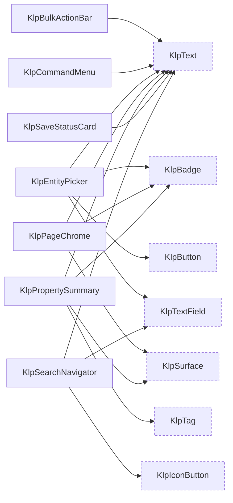

虛線框是其他領域的型別。

### routing — 分發

型別 5 個，widget 2 個。

| 型別 | 行數 | 組成 |
|---|---|---|
| `KlpRoute` | 30 | （葉節點） |
| `KlpRouteNotFound` | 32 | （葉節點） |
| `KlpRouter` | 84 | `KlpRouteNotFound` |
| `KlpRouterOutlet` | 11 | （葉節點） |
| `KlpRouterScope` | 27 | （葉節點） |

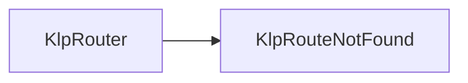

虛線框是其他領域的型別。

### shell — 應用外殼

型別 18 個，widget 14 個。

| 型別 | 行數 | 組成 |
|---|---|---|
| `KlpAppScreen` | 33 | `KlpTokenOverride` |
| `KlpAppWindowHeader` | 26 | `KlpPanelHeader` |
| `KlpContentState` | 3 | （葉節點） |
| `KlpPaneCollapseControl` | 65 | `KlpIcon` |
| `KlpPanelFrame` | 66 | `KlpTokenOverride` |
| `KlpPanelHeader` | 57 | `KlpText` |
| `KlpResponsivePaneCoordinator` | 22 | （葉節點） |
| `KlpSidebarFrame` | 33 | `KlpPanelFrame` |
| `KlpStageFrame` | 53 | `KlpTokenOverride` |
| `KlpStatusBar` | 57 | `KlpText` |
| `KlpThemePreviewMode` | 2 | （葉節點） |
| `KlpThemePreviewTile` | 311 | `KlpPressable`、`KlpText` |
| `KlpThemeToggle` | 25 | `KlpSurface`、`KlpText` |
| `KlpWindowAction` | 64 | （葉節點） |
| `KlpWindowControls` | 135 | `KlpIcon`、`KlpTooltip` |
| `KlpWindowControlsStyle` | 11 | （葉節點） |
| `KlpWindowHeader` | 231 | `KlpText`、`KlpWindowControls` |
| `KlpWorkbenchShell` | 149 | （葉節點） |

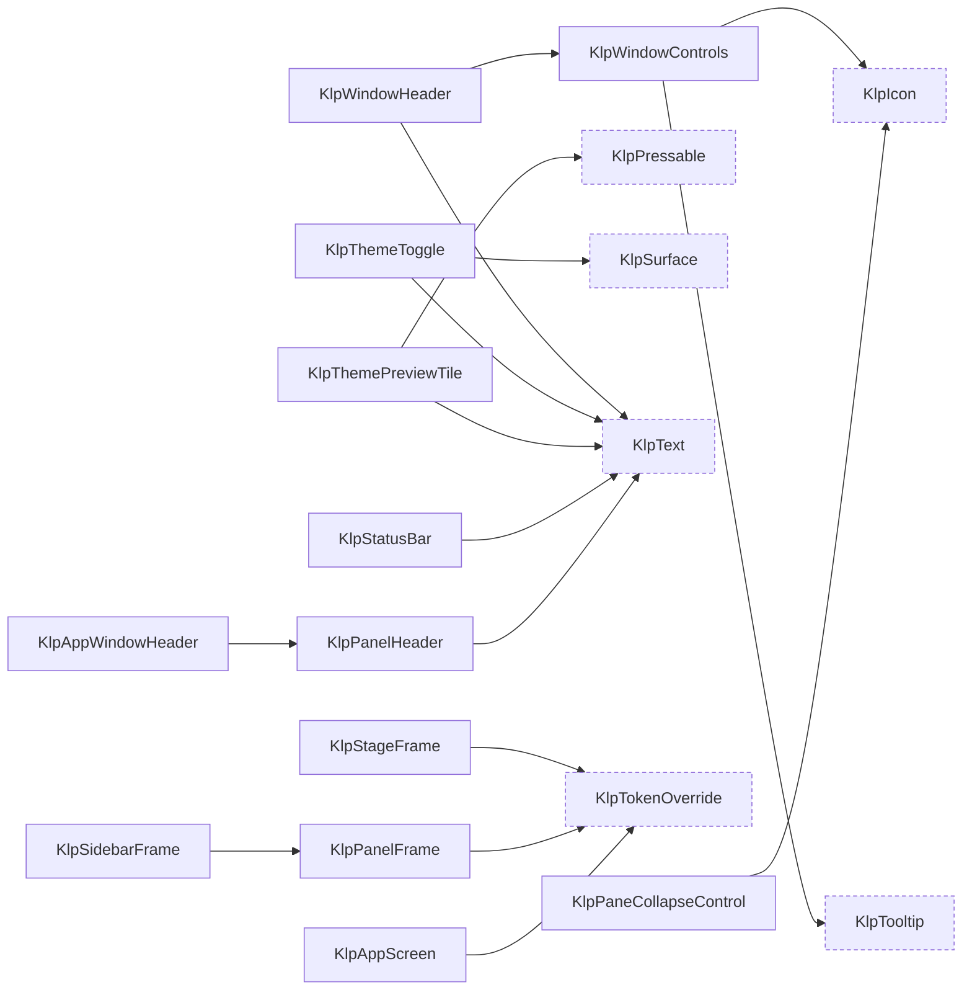

虛線框是其他領域的型別。

### settings — 設定呈現

型別 9 個，widget 8 個。

| 型別 | 行數 | 組成 |
|---|---|---|
| `KlpSettingsActionBar` | 46 | `KlpSurface`、`KlpText` |
| `KlpSettingsContentPane` | 70 | `KlpSurface`、`KlpText` |
| `KlpSettingsField` | 40 | `KlpSurface`、`KlpText` |
| `KlpSettingsNavigationGroup` | 37 | `KlpText` |
| `KlpSettingsNavigationItem` | 54 | `KlpListTile`、`KlpSurface` |
| `KlpSettingsNavigationPane` | 38 | `KlpSurface` |
| `KlpSettingsPage` | 58 | （葉節點） |
| `KlpThemeModeOption` | 15 | （葉節點） |
| `KlpThemeModePicker` | 45 | `KlpThemePreviewTile` |

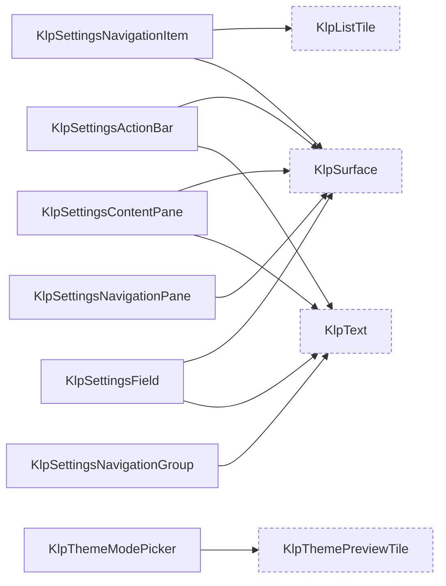

虛線框是其他領域的型別。

### app — 接入層

型別 1 個，widget 1 個。

| 型別 | 行數 | 組成 |
|---|---|---|
| `KlpApp` | 304 | `KlpLocalizationsDelegate`、`KlpRouterOutlet`、`KlpRouterScope`、`KlpWindowHeader` |

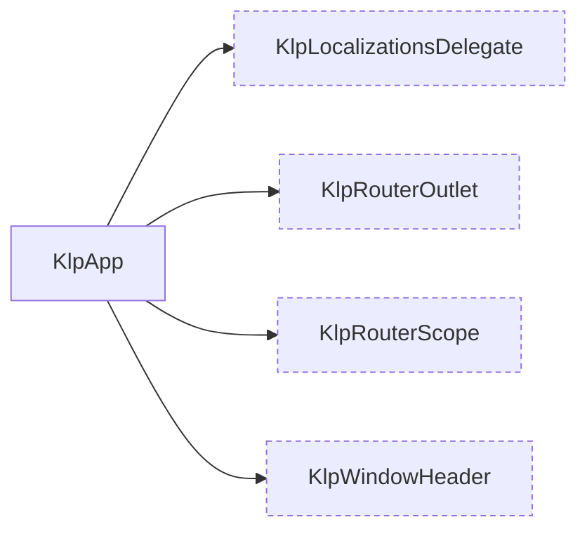

虛線框是其他領域的型別。

## 葉節點

不組合任何其他 Kallopis 型別的 widget。它們是這套視覺語言的**詞根**——
每一個都直接對應一個不可再分的視覺概念。

`KlpActionGroup`、`KlpConditionalFieldRegion`、`KlpDashedDivider`、`KlpDivider`、`KlpDropIndicator`、`KlpEditorToolbar`、`KlpForm`、`KlpGeometricSpinner`、`KlpIcon`、`KlpInlineCode`、`KlpOverlayHost`、`KlpPermissionState`、`KlpPressable`、`KlpResizablePane`、`KlpResizeHandle`、`KlpResponsivePaneCoordinator`、`KlpRouterOutlet`、`KlpRouterScope`、`KlpScrollViewport`、`KlpSegmentedProgress`、`KlpSettingsPage`、`KlpSkeletonLine`、`KlpStateHighlight`、`KlpStrokeFrame`、`KlpText`、`KlpToastStack`、`KlpToggleIndicator`、`KlpTokenOverride`、`KlpTooltip`、`KlpTooltipSurface`、`KlpTree`、`KlpVirtualGrid`、`KlpVirtualList`、`KlpWorkbenchShell`

## 被最多型別使用的

改動這些的影響面最大。

| 型別 | 被幾個型別使用 |
|---|---|
| `KlpText` | 92 |
| `KlpIcon` | 30 |
| `KlpSurface` | 26 |
| `KlpPressable` | 10 |
| `KlpButton` | 9 |
| `KlpTextField` | 8 |
| `KlpBadge` | 4 |
| `KlpDashedBorder` | 4 |
| `KlpStateHighlight` | 4 |
| `KlpStrokeFrame` | 4 |
| `KlpTokenOverride` | 4 |
| `KlpDashedDivider` | 3 |
| `KlpMenu` | 3 |
| `KlpMenuItemData` | 3 |
| `KlpTooltip` | 3 |

