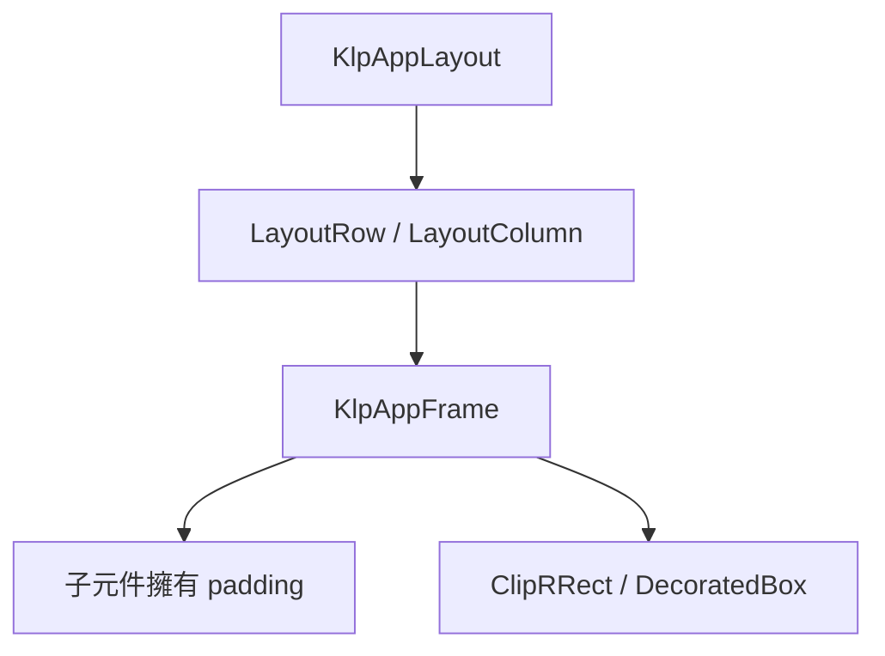
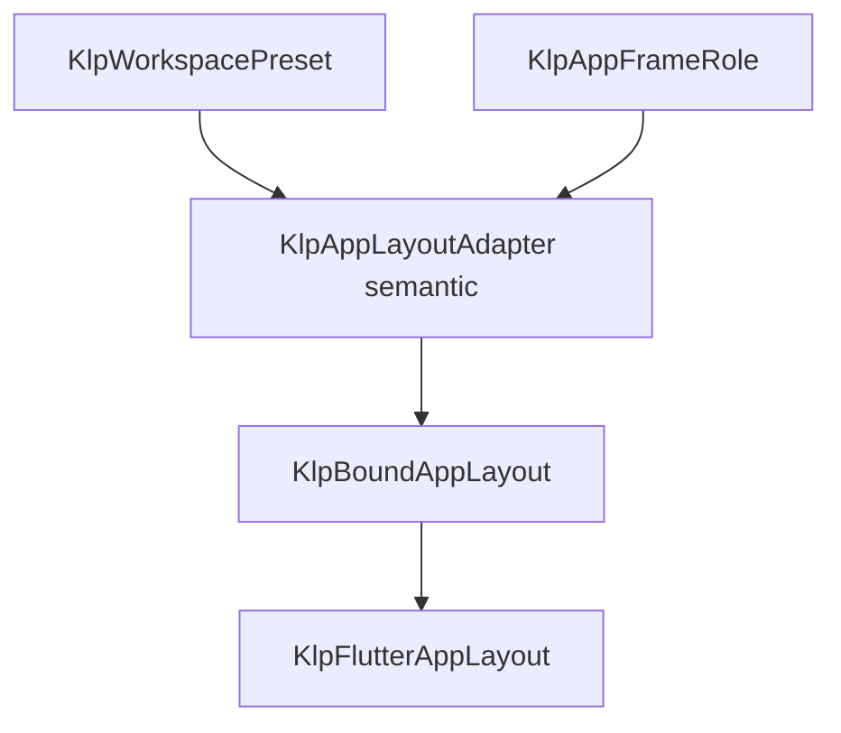

# KlpAppLayout 宣告式第一層布局

## 狀態

confirmed（2026-09-12）

## 結果

新宣告式應用以沒有內建 Header 的 `KlpAppLayout` 作為 `KlpScreen` 的第一個內容節點。消費端只提交純 Dart 資料與 callback；Kallopis 在內部將資料樹轉換為 Flutter 呈現樹。

## 範圍

- 提供 `KlpAppLayout`、`LayoutRow`、`LayoutColumn`、`LayoutResizeHandle` 與 `KlpAppFrame`。
- `KlpAppLayout` 在 app background 內四周保留第一層 frame inset；預設解析為 12px。
- 相鄰布局節點預設保留同一個 12px gutter。顯式 `LayoutResizeHandle` 取代該 gutter，短邊恆等於此 inset。
- Header 不由 `KlpApplication`、`KlpScreen` 或 `KlpAppLayout` 建立；產品若需要 header，將它以受控節點放入自己的布局樹。
- `KlpAppFrame` 只可作為 app background 上第一層 layout node，承擔第一層 surface、圓角與裁切；它不是一般巢狀容器。
- `KlpFrameGroups` 是 Frame 內容的群組根；每個 `KlpPadding` 決定自身水平內距與前置分隔線，主內容再放進群組。

## 非範圍

- 本輪不實作 resize gesture、比例狀態或持久化；`LayoutResizeHandle` 只建立固定尺寸的視覺／互動預留槽。
- 不修改不屬於本 API 的 legacy Flutter 元件。

## Resize 組裝禁令

- 未明確要求 resize 時，兩個相鄰 Frame 直接交給 `LayoutRow` 排列，只使用預設 gutter，不得插入 `LayoutResizeHandle`。
- 明確要求 resize 時，只能把既有 `LayoutResizeHandle` 當作兩個相鄰 Frame 的同層 sibling；renderer 會以它取代中間預設 gutter。
- 嚴禁建立包住任一 Frame 的 resizable sidebar、resizable frame 或同類專用節點；也不得為此另建 adapter、binding、renderer、寬度狀態或收合狀態。
- `LayoutResizeHandle` 不得與中間 padding／gutter 疊加。產品只能表達是否插入 divider，不得重寫 Kallopis 的線性間距演算法。

## 公開契約

- 宣告式入口及傳遞型別不得暴露 `Widget`、`BuildContext`、Flutter enum、`ThemeData` 或 renderer callback。
- 所有 layout node 都是純資料 `KlpNode`，可被消費端繼承或實作其公開資格介面。
- `KlpAppFrame` 的 child 只接受受控 `KlpNode`，由本庫 renderer 產生實際元件。

## 視覺與語意

| 屬性 | 權限 | 解析路徑 | 所有權 |
|---|---|---|---|
| 第一層 frame inset | 精確幾何 12px | `KlpAppLayoutAdapter.frameInset` semantic → primitive distance | Kallopis |
| 相鄰 gap | 精確幾何，等同 frame inset | 同一 resolved `frameInset` | Kallopis |
| resize handle 短邊 | 精確幾何，等同 frame inset | 同一 resolved `frameInset` | Kallopis |
| frame surface／shape | Kallopis 語意 | `KlpAppFrame` semantic → primitive color/radius | Kallopis |
| frame 內容 | 產品資料與結構 | `KlpAppFrame.child` typed slot | 消費端 |
| 群組水平內距 | `none` 或 `standard` | `KlpPaddingStyle.padding` → semantic distance | Kallopis |
| 群組前置分隔線 | invisible／dashed／solid | `KlpPaddingStyle.divider` → semantic color/stroke | Kallopis |

### 2026-09-12 核准修訂

外距、欄距與 Frame 圓角均為 12px；Frame padding 固定為 0，不提供陰影，由子元件定義自己的 padding。深色採已評鑑 B 的主次關係，預設底板／輔助區／主內容取 #222222／#292929／#323232；淺色維持既有三階色彩。

`KlpAppFrameRole.content` 為預設內容角色，`auxiliary` 為輔助區；角色不綁左右位置，也不提供 consumer 色值或幾何覆寫。此 API 增加只表達已確認的內容主次。與本規格早期 8px 列述衝突處，以本修訂為準。





```text
distance i3 → frameInset → root padding / sibling gap / resize slot
radius i3 → frameRadius → frame clip / decoration
color i2 / i3 → auxiliaryBackground / background → role → bound background
child definition → child padding；Frame 不再加入 padding
```

`KlpAppFrame` 需要多段內容時，先以 `KlpFrameGroups` 包住 `KlpPadding`。`standard` 解析為已核准的 12px 工作區節奏；`none` 解析為零水平內距。垂直節奏及每段內部 padding 都由群組內容自己擁有。分隔線出現在該群組之前，第一群通常使用 `invisible`。

```dart
KlpAppFrame(
	id: scope / 'note.frame',
	child: KlpFrameGroups(
		id: scope / 'note.groups',
		groups: [
			KlpPadding(id: scope / 'title', content: [title]),
			KlpPadding(
				id: scope / 'body',
				style: KlpPaddingStyle(
					padding: KlpPaddingHorizontal.none,
					divider: KlpPaddingDivider.dashed,
				),
				content: [editor],
			),
		],
	),
)
```

生命週期維持原本建立、重組及主題重解析；角色切換只改呈現資料，不替換子元件識別、資料或操作。驗收只凍結上述 Frame 局部契約，不凍結完整 screen。

## 驗收

1. 公開宣告式 API 的型別遞迴不含 Flutter 呈現型別。
2. `KlpScreen(child: KlpAppLayout(...))` 於無 header 時仍正確呈現內容。
3. 最外層與相鄰 node 的距離均為解析後的 12px inset。
4. `LayoutResizeHandle` 取代兩個 node 間的普通 gap，短邊為相同 inset。
5. `KlpAppFrame` 不可用作另一個 `KlpAppFrame` 的 child。
6. Frame 圓角為預設 12px；child 在沒有自身 padding 時與 Frame 內容邊界重合。
7. 深色預設主內容明度高於輔助區，輔助區高於底板；替換 primitive 時仍由語意解析，不寫死於 renderer。
8. `KlpFrameGroups` 只接受 `KlpFrameGroup`；群組可選零或預設水平內距，以及隱形、虛線或實線前置分隔線。

## 本次驗證

- 獨立範圍分析：`No issues found!`，exit 0。
- `klp_app_layout_test.dart`、`klp_app_frame_style_test.dart` 與 `frontend_architecture_boundary_test.dart`：`00:03 +166: All tests passed!`，exit 0。
- 深色 Web 範例以 `--no-tree-shake-icons` 建置成功，瀏覽器人工確認主亮輔暗、12px 外距／間距與零 Frame padding。此旗標配合既有動態 IconData，不修改圖示架構。
- 全量 Verify 完成但 exit 1：格式、根與範例分析、兩份生成清單及根與範例測試共 7 步驟未過。根測試 `+1138 -55`，範例 `+3 -6`；包含其他舊 API 遷移與並行修改問題。本次沒有擴大 allowlist、回退其他工作或重算 golden，不能宣稱整庫全綠。
