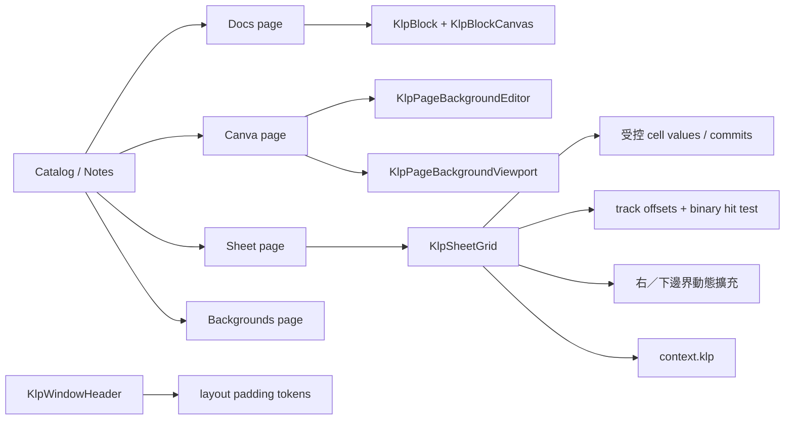

# Notes 編輯頁與無限 Sheet

## 目標與動機

讓 Kallopis Catalog 的 Notes 分組不只展示背景，而是分別呈現三種可直接組裝到 Notist 的
頁面能力：Docs 區塊式筆記、Canva 互動畫布，以及向右、向下持續延伸的 Sheet。共用元件只
保留視覺與互動契約，不帶入 Notist 或 Planist 的文件、專案與儲存語意。

同時增加 `KlpWindowHeader` 的預設橫向 padding，使 header 內容起點與下方 panel 的外側起點
對齊，並直接成為所有消費端的預設；垂直 padding 與控制鈕尺寸維持既有語意尺寸。

## 範圍

### In

- 將 Catalog Notes 分組拆成 Docs、Canva、Sheet、Backgrounds 四頁。
- 將既有 `KlpBlock`、`KlpBlockCanvas` 的權威分類移至 Docs，提供選取與新增區塊的互動範例。
- 將既有 `KlpPageBackgroundEditor` 的權威分類移至 Canva，提供 connect、select、delete、縮放
  與背景 viewport 的受控互動範例。
- 新增無產品語意的 `KlpSheetGrid` 公開元件，採受控 cell value／commit API。
- Sheet 支援 cell 選取、鍵盤移動、雙擊或 Enter 編輯、橫向與縱向捲動，接近右／下邊界時
  擴充虛擬 column／row，使使用者看不到固定終點。
- 抽取 Planist 已驗證的軌道累積 offset、二分搜尋 cell 命中、選取 reveal 與編輯流程；改用
  Kallopis token 與通用命名，不建立對 Planist 的套件依賴。
- 調整 window header 預設 start／end padding token，並更新相關 widget 與 golden 測試。
- Docs Catalog 補齊段落、H1–H4、項目／編號／待辦列表、摺疊列表與註解標題。
- Docs Catalog 補齊多欄、表格、圖片、placeholder、分隔線與資料庫預覽。
- 所有 `KlpBlock` 在 hover／鍵盤 focus 時顯示 theme 高亮，點擊後由消費端受控選取。
- `KlpBlock` 的內容安全區左上角固定提供六點操作鈕；單點透過既有 `KlpContextMenu` 開啟
  動作選單，拖曳手勢只回報給消費端決定文件順序。
- Catalog 的區塊排序為唯讀，不接拖曳 callback；多欄可獨立拖曳分隔把手調整欄寬。
- 表格與資料庫採參考圖的資訊層級：表格以空白格線及橫向捲動呈現；資料庫包含標題、
  工具列、屬性標頭、新增資料列與橫向捲動。

### Out

- 不加入公式引擎、欄位型別、排序、篩選、合併儲存格或檔案匯入匯出。
- 不加入 Notist／Planist 的頁面資料模型、持久化、undo／redo 或多人協作。
- 不在 Catalog 實作區塊重新排序，也不在 Kallopis 保存區塊順序。
- 不加入資料庫查詢、欄位型別、篩選、排序或資料列持久化。
- 不直接 import、複製 Planist design system；只移植可泛化的演算法與互動行為。
- Docs 區塊不移植 Planist 元件、DTO 或視覺規則；第一版只組裝 Kallopis 已有元件。
- 不操作執行中的 Windows 應用程式進行人工驗收。

## 方案

`KlpSheetGrid` 採 presentation-only 受控介面：呼叫端提供 `cellValueAt`，元件以
`onCellCommitted` 回傳編輯，不保存產品資料。元件內只保存選取、編輯器、scroll controller
與目前虛擬 row／column 數。接近 trailing extent 時分批增加虛擬軌道；資料仍按 cell address
向呼叫端索取，因此擴充不會配置完整二維資料陣列。

Docs 與 Canva 不新增第二套同義公開元件。它們改用 Catalog 私有 stateful demo 組裝既有
Kallopis primitive，避免 `KlpDocs`／`KlpCanva` 把產品頁面名稱污染視覺層。區塊共通互動留在
`KlpBlock`，選單觸發重用 `KlpContextMenu`；表格、資料庫與可調欄寬多欄仍留在 Catalog 組裝層，
待視覺與互動穩定後再判斷是否形成公開契約。

## 分步實作清單

1. 凍結契約與寫失敗測試
   - 檔案：本規格、window header 測試、Catalog 導覽測試、Sheet widget 測試。
   - 證據：測試會因 padding 尚未變更、Notes 尚無三頁、`KlpSheetGrid` 尚不存在而失敗。
2. 調整 header 橫向 padding
   - 檔案：geometry 預設 token、window header 測試、相關 JSON／golden（僅實際受影響者）。
   - 證據：identity 與右側控制區距離邊界皆等於新的 start／end token，既有高度不變。
3. 建立 Docs 與 Canva Catalog 頁
   - 檔案：`example/lib/catalog/note_pages.dart` 與拆出的私有 demo 檔、registry、coverage tests。
   - 證據：Docs 可新增與切換選取 block；Canva 可建立、選取、刪除 point／line 並縮放。
4. 抽取通用 Sheet
   - 檔案：`lib/src/data/` 下的 Sheet API、geometry 與 cells，`lib/kallopis.dart` 匯出。
   - 證據：cell 選取、鍵盤移動、編輯 commit、橫縱捲動與 trailing expansion 測試通過。
5. 接入 Notes／Sheet 頁並更新文件
   - 檔案：Catalog Sheet demo、component inventory、必要 golden。
   - 證據：Notes 四頁均可在明暗 theme 渲染，Sheet 互動由受控 demo 保存少量 cell 值。
6. 完整驗證與 diff review
   - 執行 Kallopis `Verify`，再執行 Notist analyze/test。
   - 證據：所有命令 exit 0；只更新能由預期視覺變更解釋的 golden。

凍結區：Notist 與 Planist 的產品資料模型、儲存層、原生 runner，以及目前工作樹中與本需求
無關的既有修改。

## 驗收條件

1. Catalog Notes 導覽依序包含 Docs、Canva、Sheet、Backgrounds，且每頁都有實際展示。
2. Docs demo 點擊任一 block 後只有該 block 為 selected；所有 block 均有 hover 與 clicked
   狀態，且由同一個 `KlpBlock` 基底提供。
3. 每個 block 的內容安全區左上角都有六點操作鈕；單點會開啟 `KlpMenu`，Catalog 不接受
   區塊拖曳，消費端可透過 drag callbacks 接手排序。
4. Docs demo 可辨識段落、H1–H4、項目／編號／待辦列表、摺疊列表、註解標題，以及多欄、
   表格、圖片、placeholder、分隔線、資料庫預覽；全部由既有 Kallopis 元件組裝。
5. 多欄分隔把手可改變相鄰兩欄尺寸，且任一欄不會縮到 theme 尺寸下限以下；窄版依閱讀
   順序堆疊。
6. 表格為可橫向捲動的空白格線；資料庫具有標題、工具列、屬性標頭與新增資料列。
7. Canva demo 可建立至少兩個 point、連線、選取與刪除，縮放後 recipe 仍使用頁面座標。
8. Sheet 在固定 viewport 內可同時向右及向下捲動；抵達 trailing threshold 後可再捲到原本
   row／column 數以外，且畫面不建立完整二維 cell 陣列。
9. Sheet cell 可由滑鼠選取、方向鍵移動、雙擊或 Enter 編輯；提交後受控 callback 收到正確
   row、column、value。
10. 空白 cell、很長文字、窄 viewport 與 theme 切換不產生 RenderFlex overflow 或例外。
11. `KlpWindowHeader` 左右內容與視窗邊界保留新的橫向 token padding，高度、垂直 padding 與
   視窗控制鈕語意尺寸不變。
12. `KlpSheetGrid`、Docs 與 Canva 實作中的顏色、間距、圓角、字體與時長只取自
   `context.klp`，token discipline 測試通過。
13. Kallopis Verify 與 Notist analyze/test 全部 exit 0。

## 風險與回退

1. **Sheet 大範圍造成 widget 數過多**
   - 偵測：捲動後 build 的 row／cell 數隨總資料量線性增加。
   - 應對：只建立可見 row，橫向用累積 offset 決定顯示 column 範圍；擴充只增加軌道描述。
2. **從 Planist 移植時帶入產品 theme 或資料語意**
   - 偵測：Kallopis 出現 `Pln` import、project/page 型別或非 token 視覺常數。
   - 應對：只保留 geometry／selection 演算法，視圖與 API 在 Kallopis 重新命名並受控化。
3. **Catalog 元件權威分類重複**
   - 偵測：`catalog_coverage_test` 回報 duplicate 或 stale specimen。
   - 應對：採「移動分類」而非重複列出；私有 demo 不登記為 public specimen。

整體回退：保留既有 Backgrounds 頁與 header token，移除新增 Notes 頁與 `KlpSheetGrid` 匯出，
不影響 Notist／Planist 的現有資料。

## 已裁決問題

- 採 A：調整 `KlpWindowHeader`。
- 對齊語意：header 內容開始位置與下方 panel 對齊，並作用於消費者預設。
