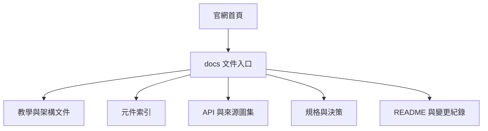
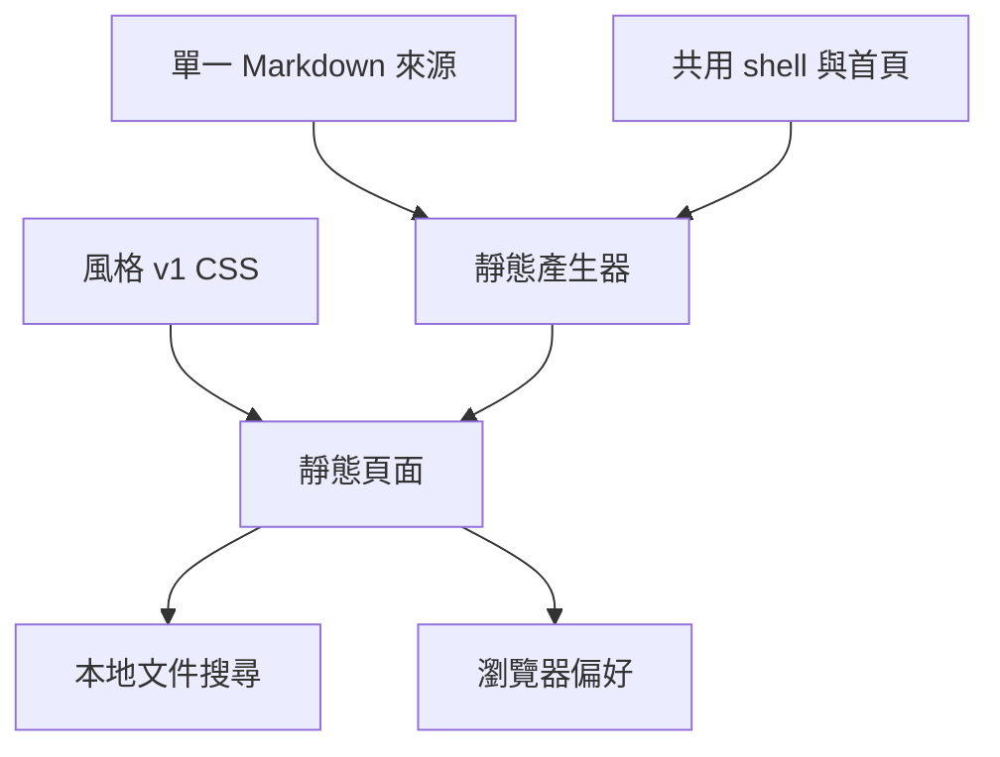

# Kallopis 官網與文件子站

2026-09-12，使用者要求蒸餾 Planist 官網至本專案、套用本專案風格，並將文件遷移至網站子頁。沿用既有 GitHub Pages 產生器；網站工作不改 Flutter 元件。

## 需求與權限

- 首頁介紹 Kallopis 實際提供的宣告式組裝、風格解析與文件能力；不搬用 Planist 的 agent、執行績效、定價或下載宣稱。
- 參考 https://miudog.github.io/Planist/ 的精簡導覽、中央主標題、工作區視覺、編號分段與進入產品的行動入口。
- 所有頁面依 [style-v1](style-v1.md) 使用暖灰、平整 Frame、12px 圓角、子內容 padding、內容紙色與微浮陰影；表單／選單以底色分層、區域分隔使用虛線。
- 預設淺色；可切換深色、暖灰／中性灰與內容微浮偏好，跨子頁保存。深色主內容比側欄亮。
- 讀者為開發者與 AI；主入口為首頁「閱讀文件」，文件入口提供開始使用、架構、元件、API 與規格。
- 原有 docs、spec、README、CHANGELOG 的 Markdown 保留為單一來源，建立靜態 HTML 子頁與相對連結轉換。`.agents` 不是公共文件站的遷移範圍。
- 不刪 Markdown，不另維護文章副本；舊 URL 提供相對轉址以支援 GitHub Pages 專案前綴。
- 本次只建立可本地預覽與既有 CI 部署的產物，不自動 push 或改 GitHub Pages 設定。

## 畫面與生命週期





```text
Markdown source → source-to-route mapping → parser → 共用文件 shell → docs 子頁
風格預設 → 可選瀏覽器偏好 → CSS 根層變數 → Frame／內容／控制
舊路由 → 相對新路由轉址；無登入、編輯或後端寫入
```

桌面文件頁為左側導覽＋中央文章＋右側段落索引；窄畫面收合導覽並改單欄。搜尋應含 API、指南、規格與元件，提供無結果／讀取失敗狀態；文章表格、程式碼、標題 anchor、圖片與 Mermaid 不得靜默遺失。鍵盤可操作導航與偏好，保留可見焦點。

## 驗收

- 產生器與既有 Pages workflow 一致，首頁／docs／舊路由可到達。
- 文件數量與來源清單一致，檢查相對連結、anchor、表格與程式碼。
- 目視桌面／窄視窗首頁與文件頁，操作搜尋、導覽、明暗與自訂風格。
- 記錄原來源中的失效連結，不以未驗證內容冒充完整遷移。
