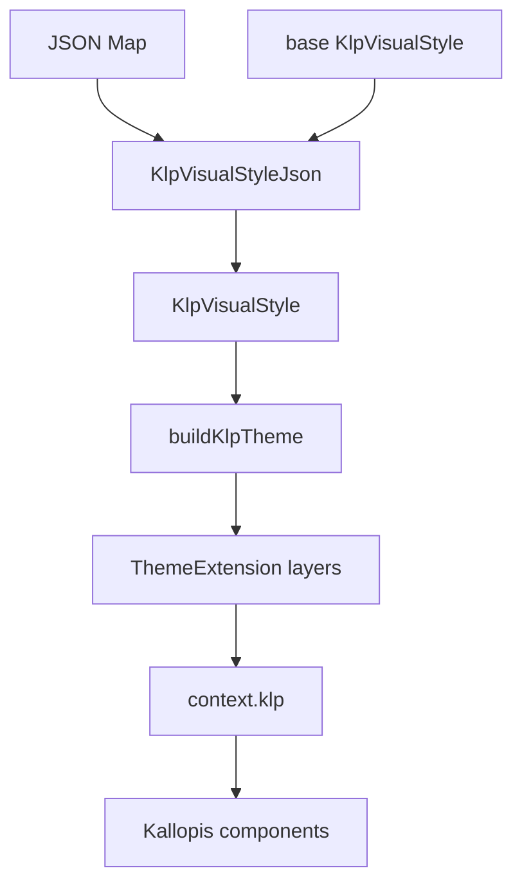

# Kallopis 0.3.0：JSON theme 與正式發布

## 目標與動機

把目前的 Kallopis 候選版本收斂成可重現的 `0.3.0` 正式套件。元件只能透過
`context.klp` 取得視覺值；消費者可把 JSON 解碼成完整的 `KlpVisualStyle`，讓顏色、字體、
間距、邊界、圓角、動態、表面效果與稀疏 component token 都由 theme 決定。第一個消費者
是同一台機器上的 Notist，因此本機 path dependency 是主要安裝方式，Git tag dependency 是
可重現的遠端替代方式。

## 範圍

### In

- 為所有 `KlpVisualStyle` semantic／component token 提供 JSON 編解碼。
- 空白或局部 JSON 以指定的 base style 補齊，避免同一條預設規則在元件內重複實作。
- 不合法的 JSON 在解碼邊界回報包含欄位路徑的 `FormatException`。
- 保留目前候選版本的視覺結果，不因 JSON 支援重算 golden。
- 補齊版本、CHANGELOG、README、GitHub CI 與本機／Git tag 消費說明。
- 建立 `0.3.0` commit 與 tag，推送到 GitHub，並確認 CI 結果。

### Out

- 不發布到 pub.dev；`publish_to: none` 維持不變。
- 不替 Notist 定義產品風格，也不把 Notist 的業務元件搬進 Kallopis。
- 不新增第二套內建視覺 preset，不重新設計既有顏色或 golden。

### 凍結區

- `KlpScale`、`KlpPalette` 的既有值不可因本工作變更。
- 元件的版面與 golden 不可因 JSON 編解碼功能變更。
- 工作開始前已存在的未提交修改只做發布稽核；不得為了縮小 diff 而回退。

## 方案

`KlpVisualStyleJson` 是唯一 JSON 邊界。解碼採 overlay 語意：JSON 沒提供的欄位沿用 base；
提供的欄位必須通過型別與範圍驗證。色彩輸出為 `#AARRGGBB`，輸入同時接受
`#RRGGBB` 與 `#AARRGGBB`；`Duration` 以毫秒整數表示；`FontWeight` 以 Flutter 的
100–900 整數表示。編碼器固定輸出 `schemaVersion: 1`；局部 overlay 可省略版本並視為 1，
明示其他版本則拒絕。編碼器輸出完整、穩定的巢狀物件，可作為設定檔樣板與 round-trip
驗證來源。

## 分步實作清單

1. 新增 JSON codec 與公開 export；證據是每一層 token 都能完整 round-trip。
2. 新增成功、局部覆寫、錯誤型別、未知欄位與邊界測試；證據是對應測試全過。
3. 強化 token discipline，禁止元件直接使用 primitive 或常見視覺字面值；證據是架構測試全過。
4. 更新 README、CHANGELOG、版本與 GitHub workflow；證據是安裝範例可解析且 CI 包含三組驗證。
5. 執行專案 Verify、審查完整 diff、提交、標記並推送；證據是本機尾行與 GitHub run 結論。

## 驗收條件

- `KlpVisualStyleJson.decode(KlpVisualStyleJson.encode(style))` 的所有可序列化 token 值與原 style 相同；
  公開 motion API 仍接受任意 Flutter `Curve`，JSON 邊界只接受可無損描述的 `Cubic`，其他
  實例會以完整欄位路徑明確拒絕，不做近似或靜默替換。
- 只提供一個 JSON 欄位時，該欄位改變且其餘欄位與 base style 相同。
- 色彩、數字、duration 或 font weight 型別不合法時，拋出的 `FormatException` 包含完整 JSON 路徑。
- 未知 JSON 欄位會被拒絕，不會因拼字錯誤而靜默略過。
- `test/token_discipline_test.dart` 可機械阻擋元件繞過 `context.klp` 直接取 primitive token。
- `dart format --output=none --set-exit-if-changed .`、`flutter analyze --fatal-infos`、
  `flutter test`、`example/flutter test` 全數 exit 0。
- JSON 功能不造成任何 golden 檔案相對於工作開始時新增變更。
- Notist 可用 path dependency；遠端消費者可鎖定 Git tag，不依賴浮動的 `main`。
- GitHub CI 在 release commit／tag 上完成，且 tag、`pubspec.yaml`、CHANGELOG 版本一致。

## 風險與回退

1. **欄位遺漏**：round-trip 測試或欄位清單閘門失敗時停止發布；以 codec commit 為單位回退。
2. **既有候選視覺混入回歸**：以工作開始時的 golden diff 清單為基準；新增 golden diff 即停止。
3. **GitHub CI 與本機差異**：Windows 跑 golden、Ubuntu 跑格式與 analyze；CI 失敗時不移動 tag，
   修正後以新的 release commit 重建 tag。

整體回退方式：Notist 固定到上一個可用 tag／commit；GitHub 端保留失敗 tag 的紀錄並以新 patch
版修復，不 force-push 已發布 tag。

## 待裁決問題

無。使用者已指定本機優先、GitHub CI/CD、JSON theme、保持風格與 Notist 為第一消費者；
repo 既有 `publish_to: none` 明確排除 pub.dev，因此採 path dependency + Git tag release。
