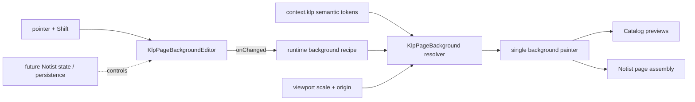

# 執行期可編輯的筆記背景

## 目標與動機

讓 Kallopis 的 ruled、dots、grid 背景在執行期接受可重用的視覺 recipe，修正目前三種背景在
明暗風格下顏色不一致的問題，並讓 dots／grid 的主軸、次軸與縮放線寬行為可獨立調整。
同一份契約也包含受限的座標式自訂背景：使用者只能建立點與點之間的線，不得注入任意繪圖
程式。Catalog 同時作為互動範例，讓未來 Notist Canva 背景編輯模式只需組裝 viewport、狀態
與保存設定，不必再實作 painter 或命中測試。

若不先建立 recipe，縮放與背景編輯功能會被迫以大量 widget 參數或 Notist 私有 painter 實作，
之後難以保存、測試，也會讓同一條視覺規則出現兩份實作。

## 範圍

### In

- 在 Kallopis 新增不可變、可比較、可 `copyWith` 的頁面背景 recipe。
- 保留既有 `KlpPageBackground(style: ..., child: ...)`，另以具名建構式接受 recipe，避免破壞
  Notist 與其他消費端。
- 新增專用 semantic 頁面圖樣色；plain 以外的預設背景都使用同一個 token，並可由 recipe
  傳入 RGB 顏色覆寫。
- ruled 可調整線色、線寬與間距。
- dots／grid 可分別調整主軸與次軸的顏色、寬度、兩條主軸間的次軸數量，以及主軸間距。
- pattern 的幾何位置隨 `viewportScale` 縮放；線寬／點徑可選擇固定或隨 scale 縮放。
- 新增頁面座標 viewport；背景圖元永遠保存頁面座標，scale／offset 只負責映射至畫面座標。
- 新增受控背景編輯元件與自訂向量 recipe，圖元只包含 point 與連接兩點的 line。
- 編輯工具包含點連、選取、刪除；點連預設吸附最近的座標格，按住 Shift 時停用吸附。
- Catalog 的 Notes / Backgrounds 頁增加參數控制、縮放預覽及座標式編輯器，並保留四種背景
  的同頁比較。
- 以 Kallopis 測試驗證 recipe、幾何、縮放和相容 API；Notist 只做消費端回歸驗證及必要的
  預期 golden 更新。

### Out

- 不在這次新增 Notist 的背景編輯入口、工具列、undo/redo、文件保存或 Krepis JSON schema。
- 不允許產品傳入任意 `CustomPainter`、程式碼、SVG 或 bitmap 作為背景；自訂圖樣只接受
  Kallopis 定義的 point／line 資料。
- 不在 Notist 實作畫布縮放／平移手勢；Kallopis 只接受外部 viewport scale／offset 並完成
  頁面座標與畫面座標轉換。
- 不處理無限畫布分塊、大型畫布快取、曲線、填色、多邊形、文字或圖片圖元。
- 不提供移動、縮放、旋轉圖元或多選框；選取工具本次只需選取單一 point 或 line。
- 不遷移 Planist 現有背景資料，也不讓 Kallopis 依賴 Planist 的 core model。
- 不重構 Notist Docs 文字、Explorer、頁面資料模型或其他 Catalog 頁面。

### 凍結區

- `KlpScale`、`KlpPalette` 與既有 primitive 值不准修改。
- Notist 既有 Docs 內容與頁面類型映射不准修改。
- 工作區內與背景無關的未提交變更及 golden 不准整理、回復或重新產生。

## 方案

公開契約採用「向後相容 widget + 型別化 recipe」，而不是把所有設定平鋪成 widget 參數：

- `KlpPageBackgroundAxisStyle`：可選的 `color` 與 `width`；缺省時由 widget 解析
  `context.klp`。
- `KlpPlainPageBackgroundRecipe`：純底色。
- `KlpRuledPageBackgroundRecipe`：單一線軸外觀與間距。
- `KlpDotsPageBackgroundRecipe`、`KlpGridPageBackgroundRecipe`：各自保存 `minorAxis`、
  `majorAxis`、`minorAxisCount`、`majorSpacing` 與線寬縮放行為。
- `KlpCustomPageBackgroundRecipe`：保存具有穩定整數識別碼的 point，以及以兩個 point id
  表示端點的 line；刪除 point 時一併刪除與它相連的 line。
- `KlpPageBackgroundViewport`：保存 page origin 與正值 scale；統一使用
  `(pagePosition - origin) * scale` 映射到畫面座標，反向映射則用於 pointer 編輯。
- `KlpPageBackgroundStrokeBehavior.fixed`：位置與間距隨 viewport scale 改變，但線寬或點徑
  維持畫面像素寬度。
- `KlpPageBackgroundStrokeBehavior.scaled`：位置、間距與線寬或點徑都乘上 viewport scale。
- dots 的 `width` 定義為點的直徑，讓 dots 與 grid 可共用同一組「寬度」控制語意；painter
  內部才換算為半徑。
- `minorAxisCount` 指兩條相鄰主軸之間、**不含主軸**的次軸數量，因此次軸間距固定為
  `majorSpacing / (minorAxisCount + 1)`。
- recipe 的顏色為呼叫端視覺輸入；未提供顏色時，三種圖樣統一解析新增的 semantic
  `pagePattern`。Kallopis 本身不硬編碼 RGB，也不直接讀 primitive。
- 既有 `style:` 建構式在內部轉成 theme-resolved 預設 recipe；新的
  `KlpPageBackground.recipe(recipe: ..., viewport: ..., child: ...)` 提供編輯與 viewport 能力。
- `KlpPageBackgroundEditor` 採受控介面：呼叫端傳入 recipe、viewport、目前工具與
  `onChanged`；元件負責 pointer 命中測試、吸附與產生下一份 immutable recipe，不保存產品
  文件或 undo history。
- 點連工具的行為固定為：第一次點擊建立起點；後續點擊建立新 point 並連接上一點，點擊既有
  point 則連接至該點；切換工具或按 Escape 結束目前連線鏈。只有單一未連線起點時，它仍是
  可渲染與刪除的 dot。
- 選取工具點擊 point 或 line 時選取單一圖元，點擊空白處清除選取；刪除工具點擊圖元立即
  刪除。選取狀態是 editor 的暫態視覺狀態，不寫入 recipe。
- 吸附以 recipe 的次軸間距作為座標格；pointer event 按住 Shift 時只對該次點擊停用吸附。

Planist 僅提供兩項已查證的參考：recipe 在建構邊界檢查 finite/positive 幾何值，以及 painter
按 viewport scale 計算圖樣座標。本方案不沿用它目前把 major width 固定為 minor 的兩倍、
也不沿用其產品 JSON，因為這兩點與本需求的獨立調整及 Kallopis 分層不符。

## 分步實作清單

1. **先建立失敗的契約與 recipe 測試**
   - 檔案：新增 `test/klp_page_background_recipe_test.dart`，擴充
     `test/klp_page_background_test.dart`。
   - 內容：固定 public type 名稱、`copyWith`、相等性、次軸間距公式、自訂 point／line 參照
     完整性、非法有限值、舊建構式相容，以及 theme／recipe 解析優先序。
   - 完成證據：指定測試因尚無新 API 而失敗，失敗原因與預期缺少的契約一致。

2. **新增 semantic 頁面圖樣色**
   - 檔案：`lib/src/theme/klp_theme.dart`、視覺風格 JSON color encode/decode 相關檔案、對應
     theme/JSON 測試。
   - 內容：三套內建明暗風格各自定義 `pagePattern`，JSON 欄位為可省略的 additive 欄位；
     不調高 schema version、不加 allowlist。
   - 完成證據：theme 與 JSON round-trip 測試通過，測試確認三種背景預設解析同一 token。

3. **建立 recipe、viewport 與單一 painter**
   - 檔案：新增 `lib/src/editor/klp_page_background_recipe.dart`，視需要將 painter 拆至
     `lib/src/editor/internal/klp_page_background_painter.dart`，修改
     `lib/src/editor/klp_page_background.dart`、`lib/kallopis.dart`。
   - 內容：實作型別化 recipe、point／line 模型、viewport 轉換、輸入防衛、主次軸迭代與
     兩種 stroke behavior；舊 API 維持相同 source contract。
   - 完成證據：步驟 1 測試轉綠；零尺寸、`minorAxisCount == 0`、scale 小於與大於 1 都不會
     發生無限迴圈或例外。

4. **以測試先行建立受控座標編輯器**
   - 檔案：新增 `lib/src/editor/klp_page_background_editor.dart` 與
     `test/klp_page_background_editor_test.dart`，公開匯出 editor API。
   - 內容：實作 page/screen 座標互轉、點連鏈、既有 point 命中、單選、刪除與 Shift 暫停
     吸附；point 使用比 line 更高的命中優先序。
   - 完成證據：widget test 以 pointer event 建立兩點一線，驗證吸附與 Shift 精確座標；再以
     select/delete 工具命中 point 與 line，確認 `onChanged` recipe 符合規則。

5. **建立 Catalog 執行期編輯範例**
   - 檔案：`example/lib/catalog/note_pages.dart`、`example/test/catalog_app_test.dart`，必要時
     增加只屬於 Notes catalog 的私有 widget 檔。
   - 內容：加入背景種類、主／次軸目標、R/G/B、寬度、主軸間距、內部分割數、zoom 與
     fixed/scaled 控制；四種預覽初始顏色皆來自 `pagePattern`。同頁加入 custom preview 與
     點連／選取／刪除工具，直接以受控 recipe 回寫畫面。
   - 完成證據：widget test 操作控制後確認 recipe 與 painter delegate 更新；切換明暗風格時
     未自訂的顏色仍重新解析 theme。

6. **視覺回歸、消費端驗證與文件同步**
   - 檔案：`spec/note-page-backgrounds.md`、`spec/component-inventory.md`、Notes 背景 golden；
     若像素確實受 `pagePattern` 預期影響，僅更新 Notist 的 Canva／Sheet 相關 golden。
   - 內容：人工檢視明暗兩態，確認 ruled/dots/grid 的預設圖樣色一致且主次層級可辨識。
   - 完成證據：Kallopis 唯一 `.vscode Verify` task exit 0；Notist analyze/test exit 0；完整 diff
     不含凍結區與無關 golden。

## 驗收條件

1. 測試以舊的 `KlpPageBackground(style: ..., child: ...)` 編譯並渲染四種背景，child 保留。
2. painter 測試在相同 theme 下取得 ruled、dots、grid 的未覆寫圖樣色時，三者都等於
   `context.klp.color.pagePattern`。
3. recipe 測試設定不同主／次 RGB 與寬度後，painter delegate 保存兩組不同的 resolved
   appearance；不以固定倍率推導主軸寬度。
4. `majorSpacing = 40`、`minorAxisCount = 3` 時，幾何測試觀察到相鄰圖樣間距為 10，且每
   40 單位出現主軸。
5. viewport scale 為 2 時，fixed 模式的 1 單位寬度仍為 1，scaled 模式為 2；兩種模式的
   主軸座標與間距都乘以 2。
6. dots 測試以 `width = 4` 繪製時，painter 使用半徑 2；grid 同值則使用 stroke width 4。
7. 非有限或非正的 spacing/width/scale，以及負的 `minorAxisCount`，在公開邊界被拒絕或由
   painter 安全降級，不得形成無限迴圈；測試須逐項覆蓋。
8. editor widget test 在座標格間點擊時得到吸附後的 page point；相同點擊按住 Shift 時得到
   未吸附的 page point，兩者不因 viewport scale／origin 改變而失去頁面座標一致性。
9. 點連工具連續點擊兩個位置後，`onChanged` 收到兩個 point 與一條 line；點擊既有 point
   可作為端點，按 Escape 或切換工具後下一次點擊開啟新連線鏈。
10. 選取工具能選取單一 point 或 line 並在點擊空白處清除；刪除 line 只移除該 line，刪除
    point 同時移除所有引用它的 line，recipe 不得留下無效 point id。
11. Catalog widget test 能操作 RGB、主／次寬度、內部分割、主軸間距、zoom、stroke
    behavior 與三種編輯工具，且每次 recipe 變更後背景 painter 判定需要 repaint。
12. 人工檢視更新後的 Notes / Backgrounds 明暗 golden，ruled、dots、grid 的未自訂顏色在
   同一張圖上像素值一致；完整 Kallopis Verify 與 Notist analyze/test 都 exit 0。

## 風險與回退

1. **semantic color schema 擴充漏同步**
   - 偵測訊號：visual style JSON round-trip、copyWith/equality 或 consumer contract 測試失敗。
   - 應對：以既有 color encode/decode 欄位清單為唯一同步點逐項補齊，不提高 schema version。
2. **viewport 轉換與吸附使用不同座標空間**
   - 偵測訊號：改變 scale／origin 後，相同頁面位置建立出不同 recipe 座標或命中錯誤圖元。
   - 應對：所有 pointer 先經單一 viewport 反轉換，再於 page space 完成吸附與 hit test；用參數化
     widget test 覆蓋 identity、zoom in、zoom out 與非零 origin。
3. **縮小時次軸或自訂圖元造成過量繪製／命中測試**
   - 偵測訊號：極小 scale/spacing 或大量圖元測試耗時異常，Catalog 拖動 zoom 時掉幀。
   - 應對：計算可見索引範圍、跳過低於像素閾值的次軸，命中測試先用 page-space bounding box
     篩選；若仍超出基準，停止增加功能而不加入快取捷徑。

整體回退：保留舊 `style:` 路徑，若 recipe 或縮放實作無法通過 Verify，可移除新增具名建構式、
recipe 與 additive semantic 欄位，回到目前單一 painter，不需修改 Notist 資料。

## 待裁決問題

- Q1 已裁決為 A：本次完成 Kallopis 契約與 Catalog 編輯器；Notist 僅做回歸驗證。
- Q2 已裁決為受限座標向量：只能建立 point 與 line；編輯工具為點連、選取、刪除；點連
  預設吸附座標，按住 Shift 時停用吸附。
- 無其他待裁決問題。

由於 Q2 改變了公開 recipe 與 Catalog 驗收範圍，修訂後的計畫仍需取得一次明確核准才進入
程式實作；沉默不視為核准。
