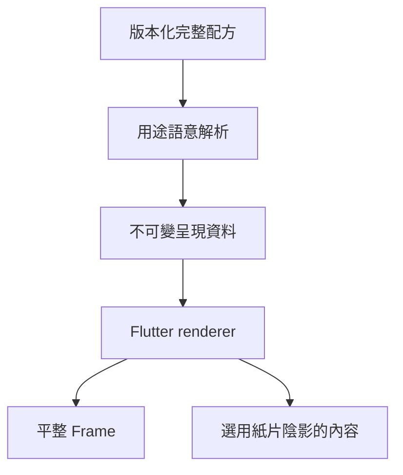

# Kallopis 風格 v1.0.0

狀態：使用者於 2026-09-12 確認顏色、padding、圓角、陰影定型並要求套用。本版本是視覺風格版本，不是 Dart 套件或完整畫面的版本。

## 範圍與不變量

來源為本對話筆記 Catalog v0.3 與使用者確認截圖。只套用顏色、padding、圓角、陰影。既有寬高、字級、字重、行高、圖示、命中範圍、欄距、block spacing、拖曳邊界、時長、布局樹與資料流程維持。Frame 繼續外距／欄距／圓角 12px、padding 0、無外框、無陰影。

本輪不新增筆記畫面、不植入紙紋、不重做下拉選單或虛線 renderer。先前確認的虛線／無邊框方向保留於設計知識，不擴張本輪四項範圍。

## 顏色

| 用途 | 淺色 | 深色 |
|---|---|---|
| App 背景 | #E7E4DD | #201F1C |
| 側欄／輔助表面 | #EFEDE7 | #292724 |
| 主內容／控制表面 | #F8F6F1 | #35322D |
| 文字 | #21201B | #F0EDE6 |
| 次要文字 | #6A655B | #BAB5AA |
| 分隔色 | #D3CFC4 | #514B40 |
| 選取／hover 底 | #E1DDD2 | #484339 |

暖灰為預設，中性灰為可選完整配方；深色必須保持背景最深、輔助較深、主內容較亮。品牌、警告、成功、錯誤等既有語意不因材料顏色而改名或合併。新宣告式原料 i7 保留既有互動色，八槽 schema 不擴張；紙色與材質完整調色不藉占用 Frame 槽位實作。

驗證修訂：使用者於實作驗證期間回覆「調整文字顏色」。淺色主文字由 #33322C 調深至 #21201B，次要文字由 #777268 調深至 #6A655B；深色陶土文字強調色由 #C18468 調亮至 #CB8E72。背景與材質色維持。依序對主內容、App 背景、深色主內容的對比約 15.107、4.562、4.650，保留既有測試門檻。

完整色組檢查後，其餘深色強調文字同範圍微調：ochre #AE8D55 → #B99860、olive #8A995C → #94A366、slate #7D94B3 → #879EBD、crimson #C37F8A → #CE8A95。對深色主內容的對比分別約 4.693、4.673、4.653、4.676；明態強調色與各色用途維持。

## Padding 與圓角

| 用途 | v1.0.0 | 所有權 |
|---|---|---|
| Frame padding | 0 | Frame renderer，維持既有 |
| 控制內距 | 8px（32px 控制尺度） | 控制 density 的 padding 用途；不改控制高度／gap |
| 筆記正文內距 | 水平 30px、垂直 28px（基準 20px 內容尺度） | 編輯 padding 語意解析；不改 block spacing／overscan |
| 控制圓角 | 6px | shape／radius slot |
| 卡片圓角 | 7px | legacy shape.card；新 surface 必須宣告適當 radius 用途 |
| Frame 圓角 | 12px | shape／Frame radius |

未有既有元件與明確用途對應的展示內距，不升級為全域值；距離 primitive 整表維持以保護其他尺寸。小圓角、膠囊與既有裝飾用途保持。新 radius i2 是控制用途，更新為 6；其餘槽位維持。

## 陰影

紙片微浮為兩層黑色 alpha 34/255，第一層 offset(0,2)、blur3、spread0；第二層 offset(0,8)、blur20、spread0。使用者可關閉內容微浮。Frame、Rail 與一般結構容器不因此產生陰影。

新宣告式 surface 透過可選陰影語意（顏色＋尺度）編譯為 bound 資料，由 renderer 在裁切之外繪製；尺度 12 對應上列配方，完整尺度替換時成比例。原有 surface 未指定陰影時保持平整，不憑空指定紙張角色。Legacy surface 在既有分層模式下解析相同雙層配方，關閉時保持空清單。

## 解析與邊界



```text
完整 preset → primitive slot → 元件具名 semantic → prepared/bound → renderer
控制尺度 → padding 比例 1/4；其他尺寸比例維持
編輯內容尺度 → 水平 padding ×1.5、垂直 padding ×1.4
surface shadow color＋scale → 固定雙層 recipe；未宣告 shadow → 無陰影
```

## 驗收

- 精確核對暖灰深淺色與明暗順序、控制與 Frame radius。
- 核對距離、字體、時長、stroke 等非授權原料保持。
- padding 測試同時證明高度、gap、字級、命中範圍不變。
- 陰影解析遵守完整 style 替換、關閉與 clip 邊界；Frame 不浮起。
- 執行針對性測試與唯一 Verify 入口，記錄既有或並行修改造成的失敗；不為未定型的完整 screen 更新 golden。

## 實作驗證紀錄

- 獨立最終針對性驗證：`00:05 +258: All tests passed!`，exit 0；涵蓋風格／陰影／JSON／色彩與既有對比門檻／padding／Frame／編輯／公開入口／匯入／前端架構邊界。
- Flutter Web：`Built build\\web`，exit 0；實際工作區目視暖灰、12px Frame 與零內距。此為 Web renderer 驗證，沒有宣稱 Windows 原生完整產品驗收。
- 架構圖集：1146 Dart 檔無語法錯誤，1146 檔案頁、270 目錄頁、3512 圖，產生前自動備份原圖集。
- 唯一全量 Verify：exit 1，7 個步驟失敗。該快照包含修正前的本輪問題，後續以上述針對性測試重驗；未重新宣稱全量通過。仍有遷移中的舊 API／KlpId 問題、清單過期與 golden 差異，未重錄完整畫面 golden。沒有完整基線紀錄，不能將全部剩餘失敗斷言為既有。
- 風格版本定為 1.0.0；未改套件版本、未提交或發布。
